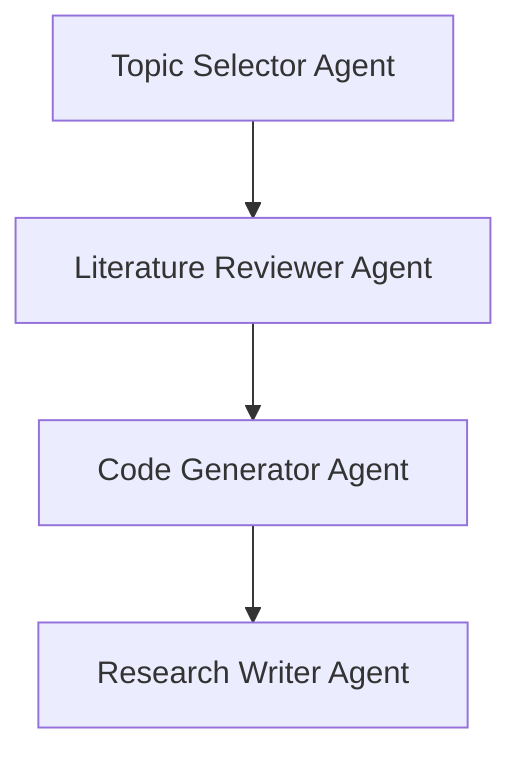

# 🤖 AutoResearcher: Autonomous Research Paper Generator with CrewAI

AutoResearcher is a multi-agent system powered by [CrewAI](https://github.com/joaomdmoura/crewAI) that simulates a research team—from identifying trending AI/ML topics to performing literature reviews, generating code, and drafting a LaTeX research paper.

## 🔍 Problem Statement

Manually preparing research papers is time-consuming. This project automates the entire research workflow using LLM-powered agents.

## 🧠 Architecture



Each agent has access to specialized tools (search, vector DB, codegen) and passes tasks sequentially.

## 🚀 Features

- 🔎 Web scraping for trend detection
- 📚 Literature review using vector similarity search (FAISS)
- 🧑‍💻 Code generation via GPT API
- 📄 Draft generation in plain text (LaTeX-ready)
- 🌐 Streamlit interface
- 🐳 Docker-ready deployment

## 🧰 Tech Stack

- 🧠 [CrewAI](https://github.com/joaomdmoura/crewAI)
- 🦜️ LangChain Tools (search, FAISS, etc.)
- 🤖 OpenAI GPT-4
- 🐍 Python 3.10
- 📦 Streamlit (UI)
- 🐳 Docker (deployment)

## 🗂️ Project Structure

```
AutoResearcher/
├── agents.py               # Agent definitions
├── tasks.py                # Task flow setup
├── crew_setup.py           # Crew execution script
├── tools/                  # Custom tools for agents
│   ├── search_tools.py
│   ├── code_gen_tools.py
│   └── vector_db_tools.py
├── outputs/                # Paper drafts generated
│   └── paper_draft.txt
├── ui/
│   └── app.py              # Streamlit frontend
├── requirements.txt
├── Dockerfile
└── README.md
```

## 🧪 How to Run

### 1. Clone the Repository

```bash
git clone https://github.com/yourusername/AutoResearcher.git
cd AutoResearcher
```

### 2. Install Requirements

```bash
pip install -r requirements.txt
```

### 3. Run the Crew

```bash
python crew_setup.py
```

### 4. Run Streamlit UI

```bash
streamlit run ui/app.py
```

## 🐳 Docker Deployment

```bash
docker build -t autoresearcher .
docker run -p 8501:8501 autoresearcher
```

## 🌐 Live Demo (Render)

> Coming Soon: [https://autoresearcher.onrender.com](https://autoresearcher.onrender.com)

## 🧠 Agent Details

| Agent | Role | Tools Used |
|-------|------|-------------|
| Topic Selector | Picks trending AI topics | DuckDuckGo Search |
| Literature Reviewer | Summarizes top 10 papers | FAISS Vector Search |
| Code Generator | Builds sample ML code | OpenAI GPT API |
| Research Writer | Compiles full paper draft | Text generation only |

## 📄 Example Output

```
Title: Leveraging Sparse Transformers for Time Series Forecasting

Abstract:
This paper explores...
```

## 📜 License

MIT License

## 🙋‍♂️ Author

Made with ❤️ by Rohan G.
